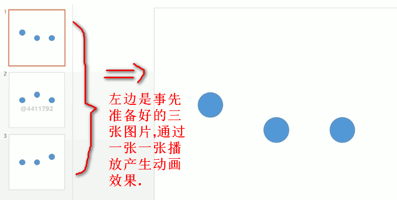

# Android 动画基础
## 第一章 课程介绍
### 1-1 课程介绍
1. 动画的意义
- 视觉效果

        优雅的动画能大幅度提升应用的观感,给用户带来良好的视觉感受.
- 引导用户

        好的动画能合理的吸引用户的注意力,起到引导用户的作用,让他们更轻松的理想我们应用的行为.
2. 课程目标
- 了解定义逐帧动画的方法
- 掌握定义视图动画的方法
- 掌握定义属性动画的方法
3. 学习内容
- 逐帧动画

        逐帧动画的基础是帧,也就是图片,这些图片一般由公司里的美工来制作,没有原图就没有办公应用逐帧动画,应用的范围就比较好.
- 视图动画系统
        
        视图动画系统操作的是视图对象,可以让他们透明度渐变,位移,旋转等效果. 视图已经可以定义丰富的动效了,但是它有局限性.
        通过对视图动画的学习我们可以掌握动画的基本属性.
- 属性动画系统
    
        属性动画系统操作的对象不再局限于视图,而且它可以真实的改变对象的属性.
        
 
## 第二章 逐帧动画
### 2-1 逐帧动画
1. 什么是逐帧动画
        
        逐帧动画又叫做图片动画,通过在一个固定区域一张一张的呈现事先准备好的一系列图片而产生动画效果.
2. 案例展示

3. 实现方法
    -  使用AnimationDrawable来定义逐帧动画
    
    它是一个Drawable的容器,我们可以理解为它事先加载好了一系列图片.和普通的Drawable一样,它可以设置为视图对象的背景.
    最简单的定义逐帧的方法就是在xml文件中通过<Animation-list>来定义AnimationDrawable对象.

4. 代码实现
    
    FrameAnimationActivity

## 第三章 视图动画(重点)
### 3-1 视图动画-原理
### 3-2 视图动画-透明动画
### 3-3 视图动画-缩放动画
### 3-4 视图动画-位移动画
### 3-5 视图动画-旋转动画
### 3-6 视图动画-集合动画
### 3-7 选择练习
### 3-8 视图动画-插值器
## 第四章 属性动画(重难点)
### 4-1 属性动画-原理
### 4-2 属性动画-ValueAnimator
### 4-3 属性动画-ObjectAnimator
### 4-4 选择练习
### 4-5 属性动画-ViewPropertyAnimator
### 4-6 属性动画-AnimatorSet
### 4-7 选择练习
## 第五章 课程总结
### 5-1 课程总结